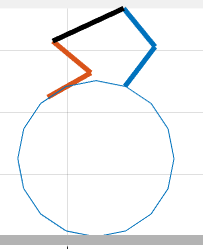

# Progress report 20191213

## overview
- I implemented the planar environment
  - Using "cheetah" model which is modified from RABBIT
  - Holonomic constraint assumptions for contact points of dog and ball
  - Theoretically the total energy should be conservative, but in experiments there seems to have some energy dissipation.
  - Currently I am still stuck with large input torques. I think I can only add unilateral constraints, friction cone constraints and collision constraints after solving the problem of force saturation.
- I experimented two kinds of force control(different in dimensions of desired wrench)
  - robot's posture wrench
    - Grasp Map is 3x4, No singularity problems of the matrix, torque is reasonable.
    - But the control is bad.
  - robot's posture wrench + ball wrench
    - Grasp Map is 4x4, Have singularity problems, torques can be about 1e7 (Forces are fighting against each other)
    - Control is stable
    - With `fmincon` for choosing proper initial and desire state, the input torque is still large.


> The robot's joints are fixed with High gain. Because of the simple model, the robot will roll together with the ball. This experiment is for the purpose of checking that the dynamics is reasonable.

**However, there are some unexplained anomaly**

#### 1. should be able to reach the original height

As in this model there is no friction energy dissipation(The ball has no relative sliding against the ground), and the robot is of a fixed height. Then as the "robot ball" rolls, it should be able to reach the original height, but from this figure, it didn't. Currently I think it is because of some error in the numerical calculation of ode45.

#### 2. The ball should turn right.

In this GIF, the initial state of this robot is a posture with symmetric standing points. As the robot's leg have weights, the Center of Mass of the system should be on the right, and the ball should turn right. But the ball turned left, and it only turns right when the whole system is turned an angle greater than `pi/15`

The functions for kinematic and the so called "DriftVector" is calculated automatically in the FROST system(after changing the urdf). I manually checked the kinematic functions is correct so I assumed that the result of `calcDriftVector` is also correct. **I will check this again.**

Another explanation might be the controller slightly pushed the robot in that way?

## Contact force control with only robot's body posture


I calculated the desired wrench following PID for the robot's x,y,$\theta$ (Not that for CoM's). And use `pinv` to compute the contact force. The result for the control can be seen in the figure.


## Contact force control with desired wrench for the ball


As the dof is 4, I added another constraint to be the desired wrench applied on the ball. As shown in the GIF, the robot can be very stable.

**However a huge problem is that it requires large torque**


The reason for this is the condition numbers of the grasp map of the some of the robot postures bad.

 

>The condition numbers of the left and the right are 7.0207e+07 and 4.1344, although the looks almost the same.

I tried to turn the weights between the wrenches. And add L2 norm effects in the calculation of `pinv`. Concretely,

```matlab
Fc = inv(Gmap'*Gmap+ 1e-14 *eye(4))*Gmap'* Wrench;
```
and turn the coefficient here. However, the small contact force yields unstable and unacceptable results again.


## Find better initial and desire condition with `fmincon`

I thought the above problem may be caused by starting from some hand designed states, which is far from a equilibrium point. So I use `fmincon` to change the initial state and the desired state. And try to minimize the maximum torque in the control process( the controller is not changed)


The result is more stable, but still takes very large torques.


## Future plan

- Check the correctness of the "DriftVector"
- Use trajectory optimization or LQR?
- After solved the torque saturation problem, add other constraints.