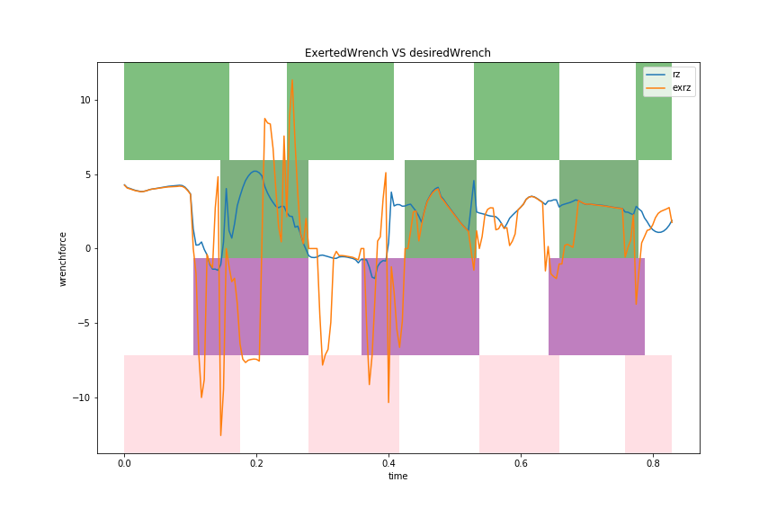

# Progress report 20191227

## Overview
- I implemented WBC in pybullet and now able to stepping on the ball
  - The controller can move robot in desired direction but is not very agile, stable, and accurate
  - The controller is using global states(including `getContactPoints`), rather than inference the state of the robot from sensors
- I installed MIT's Cheetah-Software and will dig into their WBC controllers

## Stepping on the Ball

As I just put the robot on the ball this afternoon, I have not tested how long it can last.

The robot is designed to track its CoM to the ball's. The following figure shows the x coordinate of the ball and that of the robot.

## Controller Structure

The controller contains three modules:
- **Meta:** the controller to decide which leg use torque control rather than pos control
- **pos:**  compute target positions for peds
- **tau:**  compute torques for joints

### MetaController

The basic policy is control the swing legs with pos_controller and control the stance legs with tau_controller. But, the swing legs will be switched to tau_controller if the leg is contact with ground(or ball) and is going down. Besides, the stance legs will be switched to pos_controller if it loses contact with ground.

So the policy is:    
`use_tau_ctrl = (is_stanceleg or is_going_down) and is_in_contact`

### PosController

The targets of the peds are around some "origin" positions. The "origin" positions are relative to robot's `x`, `y`, `rz`. That is, those positions will not change if the robot turned in roll and pitch direction.

In stepping behavior, the height of the swing peds follows a sine wave.

To make the robot's torso steady, a feedback of the abduct height is added to the target height of the peds.    
`target_ped_height = gait_height + gain*(abduct_height - des_torso_height)`

> Note, currently, the target positions just follows the robot's torso. It takes no account of where the robot is moving. I may add this in the future.

### TauController

The taucontrollers are just as taught in class, and the weights for transitional force and rotational force and the norm are follows the suggestions in the paper: 10,1,0.01. 

The main difference here is the calculation of the desired wrench. In the controller for stepping on the ball, the xy direction's wrench is a feedback of the CoM and the center of peds, plus a feedback of the CoM and the center of ball.

`wrench_xy = gain1 * (peds_center_xy - CoM_xy) + gain2 * (ball_xy - CoM_xy) + Kd...`

The z direction wrench is normal PD but takes into consider the desired position of the peds.

The xy direction wrench looks weird but it is `wrench_xy = gain1 * (peds_center_xy - CoM_xy) + target_direction + Kd...`, which I found works better than some other PD following some position or speed trajectory.

### Performance of the Controller

**The robot looks quite unstable and clumsy**

In the figure above, the `target_direction` is set to the four directions, so this is a open loop control of the robot's position with on guarantee of the accuracy of the result CoM position.

**The wrench has drastic oscillation**

The figure above shows the desired wrench and the foot contact states when the robot is walking in x direction.

The filled areas represent the contact states. At each time t, the ped is in contact with ground if the corresponding area is colored. The areas from low to high represents the legs of fr, fl, br, bl

I clipped the desired wrench otherwise the robot will lose control.

**The desired wrench is hard to follow in underactuated states**

The following figures compare the desired wrench and the exerted wrench from the solved contact force.

The x,y,z direction's wrench always fail to be as large as the desired one. The rx wrench is constantly small regardless that the desired one is very large. A lot of undesired effects acts on the rz direction. 

**The legs cannot be lift higher or slower**

From my tests, the robot becomes drastically unstable if the legs(or the torso) is lifted higher or the frequency is set slower.

### implementation details

- **dt**: 1./240.
- **step frequency**: 4
- **swing foot height**: 0.05
- **torso height**: 0.25

## Future plan

I think currently the most important thing is to improve the performance of the stepping controller. For that, I have installed the MIT's Cheetah-Software and will dig into their WBC controllers.

I will also test the performance of the stepping controller on the ball. And try to use the target robot CoM position to control the movement of the ball.