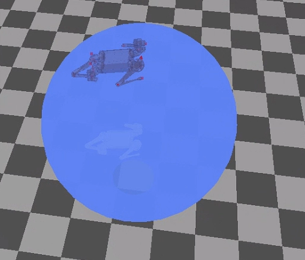

# Progress report 2020-1-18

## Overview

I completed the framework of the dynamic simulation of the cheetah and the ball in the MIT cheetah-software. The outcome is quite reasonable as the following. 

> The robot tries to push the ball, and the ball is blocked by another fixed object. (The white robot is the state estimation of the robot, and not related to current problem)

However, when the robot is initialized on the top of the ball, and lies on it with no action torques, the ball will stay at a weird angle instead of rolling, like the following(which will not be the case in pybullet):

The robot falls off when it tries to stand up on the ball, and currently the controller must start from a "relaxing" state, so I haven't tested about the robot stepping on the ball.

Besides the above anomaly, I cannot find obvious problems  that shows the dynamic is wrong. I am not sure whether the problem is caused by bugs in my implementation or is a natural phenomenon when I represent the ball with only 144 points(instead of more points). So, I am wondering the following question:
1. Is there a bug in my implementation for calculating reaction force?
2. Is 144 points enough for the collision model of the ball?

## Implementation Details

### Object relationships

In the original implementation, the cheetah is *floatBaseModel* and the floor is *terrain*, other fixed shapes that interact with the model are also terrains. The dynamic of the floatBaseModels simulated, and the terrain objects judges whether each contact point of the floatBaseModel has contact with the terrain.

The added ball has both properties. It is a floatBaseModel that have its state and dynamic, and it is putted into a special class of terrain where the reaction force is taken. So the ball interact with the cheetah as terrain, comparing the distance to the cheetah's gcpoins(ground contact point) with its radius. And it interacts with the floor as a floatBaseModel, with 144 gcpoints representing the ball( The points are read from the `sphere.obj` in the project).

The contact force on the ball is simply the opposite of the contact force on the cheetah.

### Contact model

The original implementation has two kinds of contact model, SpringDamper and Impulse. They use Impulse contact model as the default configuration. And the performance with impulse model is better than the SpringDamper. In the first gif, the robot is moving forward without any command under the springDampler contact model. However, under the Impulse model, the robot stays at its position.

Currently my implementation uses the springDampler model, I will learn the impulse contact model and transplant on that too.

