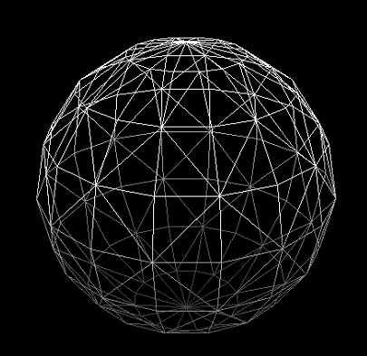
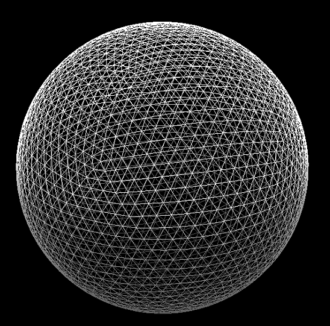

# BB Cheetah report 2020-2-1

## Overview

Now the cheetah can clumsily walk on the ball.


> The cheetah walking on the ball. The white cheetah is placed where the xy position is the same as the ball.

I found it that the main reason for the cheetah not able to stand on the ball is that the ball's surface is not smooth enough (the number of vertices in its `.obj` file is not enough). After I made the ball with more vertices, the cheetah is able to trot on a heavy ball(under small disturbances) without any feedback from the controller.

## The problem before: ball's model

The ball is modeled as a floating base model to the ground, using its ground contact points to calculate the interaction with the ground. On the other hand, it is modeled as a sphere terrain to the robot, where the robot's ground contact points are used to judge the contact state. So, the number of ground contact points of the ball affects the smoothness of the ball's rolling, which affects the stability of the robot.

**Before, the ball was modeled as 144 points**



**In the Gif above, the ball was modeled as 2562 points**



## The system is a stable system itself given large ball weight

The following experiment is done with no feedback control is added from the high-level controller. With the ball weights 50 and ball's radius 1. The robot is not able to stand a kick of velocity 0.2 in x-direction while it does if the ball's weight is 75. 

In this experiment, the robot's controller "think" that it is at a flat ground, and has no feedback about its velocities and positions. The system is stable because the ball rolls to the direction of the deviation of the robot.


## PD controller of the robot

Currently, the robot has PD control over its position and a P control about its angle. I took advantage of `ConvexMPCLocomotion.cpp` by changing the `v_des_world` in the file, which means the desired high-level velocity in the world frame.

So the control in the x y direction is 
```cpp
v_des = Kppos*(ballP - robotP) - kdpos*robotV - kprpy*robotR
```

Below is the experiment with:
- ball radius: 1
- ball mass: 10
- kppos: 0.5
- kprpy: 0.5
- kdpos: 5


> at the 5th second the robot is kicked with velocity 0.2

